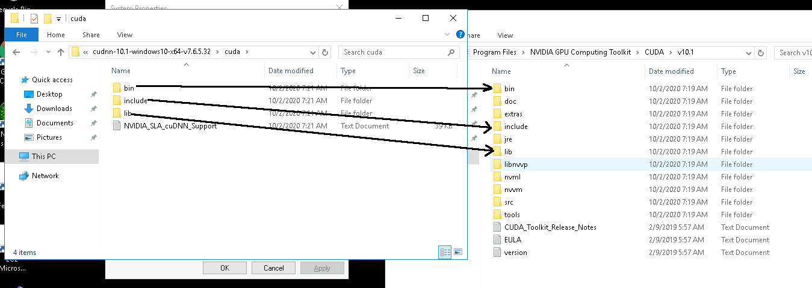
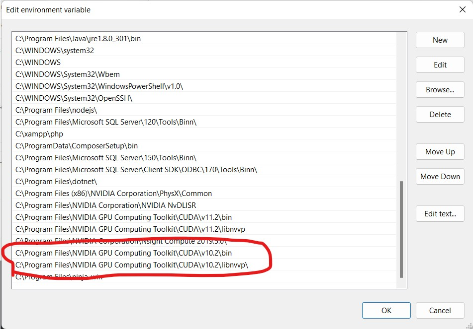
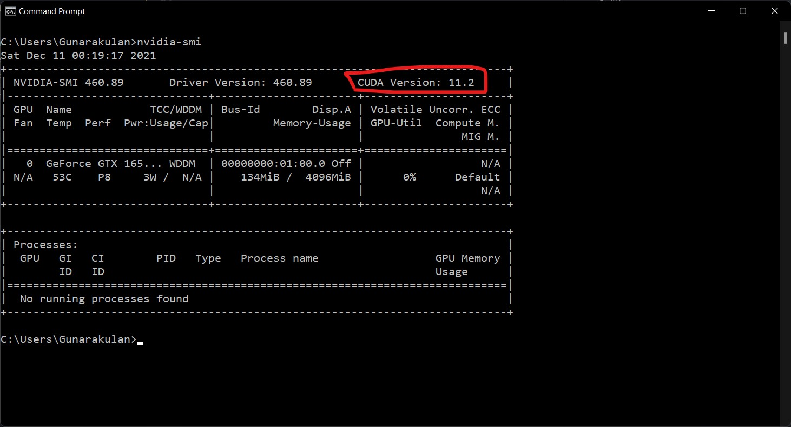

# Introduction to Object Detection Alerting System

Object detection is a computer technology related to computer vision and image processing that deals with detecting instances of semantic objects of a certain class in digital images and videos.

This software application is used to create an alerting or a warning systems for certain objects. It is using an object detection model that was trained with coco-2017 dataset. (Pre-Trained model of Google TensorFlow). There are 80 objects (labels) are available within this model. Those can be used to customize and develop alerting and warning system via configuring the pipeline.

For an example, If we want to build an elephant detection system with alarming, we can simply configure a system with it. Likewise, If we want to build a human detection system with alarming for private areas, we can simply customize a system with it.

From the object list, we can choose that what are objects to be detected and do we want the alarming and etc.     

## Technical Information

This object detection alerting system is developed with Python and C#. Python is responsible for the computer vision related operations. TensorFlow and OpenCV are the main framework of this project. TensorFlow is used to handle logic behind model loading, manipulation and etc. OpenCV is used to handle vision related tasks such as video plotting, drawing rectangles and etc.  


C# is responsible for management panel and the user interface of this system. It changes the behaviours of object detection by adjusting parameters.


#### Programming Languages & Frameworks
- Python
- C#
- SQLITE
- OpenCV
- Argparse
- Playsound
- Pyttsx3
- TensorFlow
- Protobuf
- TensorFlow Object Detection Framework


#### Technical Requirements

- Python 3.8
- .NET Framework 4.7.2

## Configuration & Setup

This project supports CPU and GPU environments to run. If your computer has a GPU (Graphics Processing Unit) with CUDA-Enabled, You can setup a GPU-TensorFlow version to run this application much faster.

If you don't have a GPU, you can still install this application with CPU-TensorFlow version. However, the processing speed with CPU is much slower than the processing on GPU.

If your computer has a GPU, you need to install CUDA & CUDDN to enable the GPU support for TensorFlow. Installation process of CUDA & CUDDN is a bit tricker than the normal TensorFlow installation.

### Installing CUDA & CUDDN

If your computer has no GPU, You should skip this installation, you can run this application with CPU. However, It will be much slower. If your computer has a GPU but, you don't like to install CUDA & CUDDN, you can still skip this process. But, this application will only use CPU for tensor processing even though you have a hardware-based GPU. Therefore, CUDA & CUDDN installation process is very essential to enable the GPU support for computer that a GPU.

Note: If your computer has no GPU, You shouldn't install CUDA & CUDDN. You can skip this installation and go ahead with next step.


#### Checking suitable CUDA & CUDDN verions for TensorFlow.

Check Here:- [https://www.tensorflow.org/install/source#gpu](https://www.tensorflow.org/install/source#gpu)


We are going to install TensorFlow (V 2.7.0), Therefore, we need to install CUDA (V 8.1) and CUDDN (V 11.2) according to the chart above.

First, we need to install CUDA (V 8.1) then, we should install CUDDN (V 11.2) for the TensorFlow (V 2.7.0).

The above chart clearly explains which CUDA & CUDDN versions that we should install for the selected TensorFlow.


#### Installing CUDA

Download CUDA From Here:- [https://developer.nvidia.com/cuda-toolkit-archive](https://developer.nvidia.com/cuda-toolkit-archive)


Download & Install the appropriate CUDA version from the official website of NVIDIA.The installation process is simple, we can install it with the GUI installer.


#### Installing CUDDN
Download CUDDN From Here:- [https://developer.nvidia.com/rdp/cudnn-archive](https://developer.nvidia.com/rdp/cudnn-archive)


Download & Install the appropriate CUDDN version from the official website of NVIDIA.This time, the installation process is bit tricky.

01.Download and Extract CUDDN zip.

02.There are 3 following folders in it.
 * bin
 * include
 * lib

03.Open the CUDA Installation directory (WHERE is the CUDA installed) Ex: (C:\Program Files\NVIDIA GPU Computing Toolkit\CUDA\v11.2)



04.Copy all content from bin, include, lib folder from the extracted CUDDN zip to the installed CUDA directory's bin, include, lib. An example is shown above.

#### Add CUDA & CUDDN Path to the environment variable.

After that installation of CUDA & CUDDN, we need to add the path to the environment variable. Go to PC settings and add them. If you don't know how to add them, just google it.

01.We need to add the following path.

 * Bin Path
 * Libnvp Path

 C:\Program Files\NVIDIA GPU Computing Toolkit\CUDA\v10.2\bin

 C:\Program Files\NVIDIA GPU Computing Toolkit\CUDA\v10.2\libnvvp\


Note: Make sure to add the correct path.




#### Check CUDA & CUDDN installed successfully.

- Open CMD and Type

  ```
    nvidia-smi
  ```



If it shows like above, that means you have successfully installed CUDA in your computer.

### Installing TensorFlow

- Installing argparse

  ```
    pip install argparse
  ```

- Installing psutil

  ```
    pip install psutil
  ```

- Installing keyboard

  ```
    pip install keyboard
  ```

- Installing playsound

  ```
    pip install playsound
  ```

- Installing SpeechRecognition

  ```
    pip install SpeechRecognition
  ```

- Installing Pynput

  ```
    pip install pynput
  ```


## Run Method 1


```
  Execute the (voice_typer.exe) that is found on "Voice_Typer\bin\Debug"
```

## Run Method 2

```
  Open the project using Visual Studio and click debuging to run the project.
```


Any Questions? | Conduct Me
---

* [Linkedin Profile](https://www.linkedin.com/in/gunarakulan-gunaretnam-161119156/)
* [Facebook Profile](https://www.facebook.com/gunarakulan)
* [Twitter Profile](https://twitter.com/gunarakulang)
* [Instagram Profile](https://www.instagram.com/gunarakulan_gunaretnam/)
* [Youtube Channel](https://www.youtube.com/channel/UCMWkED5sabgVZSCKjZuRJXA/videos)
